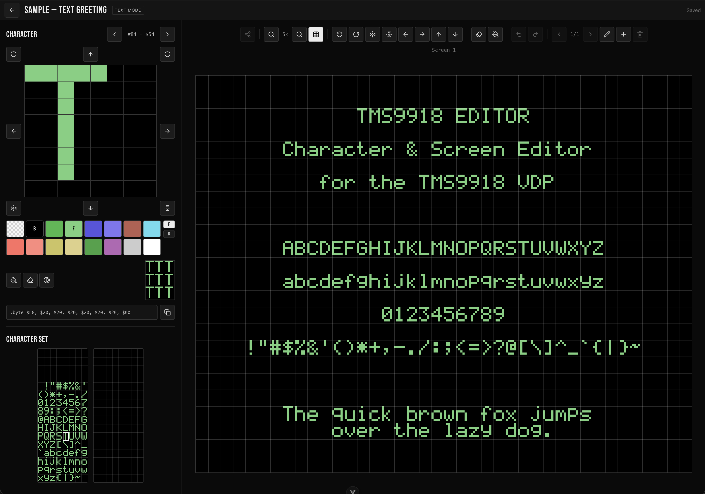

TMS9918-EDITOR
==============

A browser-based character set and screen editor for the [TMS9918](https://en.wikipedia.org/wiki/Texas_Instruments_TMS9918)
Video Display Processor — the graphics chip behind the TI-99/4A, ColecoVision, MSX,
Memotech, and many other early-1980s machines.

Design 8×8 character patterns, colour them with the TMS9918's 15-colour palette, lay
them out across one or more screens, and export the result as 6502 (`ca65`) or Z80
assembly, BASIC `DATA`, raw binary, or PNG. A dedicated **Multicolor** mode swaps glyph
editing for a 64×48 grid of chunky 4×4 colour blocks, and **Sprite** mode covers the
hardware's sprite layer — 8×8 or 16×16 patterns with animation playback. Everything runs
client-side; projects are saved in your browser, downloadable as JSON, and shareable as a
single self-contained link.




## Features

- **Five project types**, each with its hardware-accurate colour model:
  | Mode | Screen | Cell | Patterns | Colour |
  |---|---|---|---|---|
  | Text | 40×24 | 6×8 | 1×256 | one global fg/bg pair |
  | Graphics I | 32×24 | 8×8 | 1×256 | fg/bg per 8-character group (32 groups) |
  | Graphics II | 32×24 | 8×8 | 1×256 mirrored **or** 3×256 independent (screen thirds) | fg/bg per pixel row |
  | Multicolor | 64×48 | 4×4 | — | one solid palette colour per block (no glyphs) |
  | Sprite | — | 8×8 or 16×16 | 1×256 (the 2 KB sprite pattern table) | one solid colour per sprite |
- **8×8 pixel editor** with fill / clear / invert, wrapping shifts, rotate, and flip —
  every edit undoable.
- **Character-set picker** rendering all 256 glyphs in their true colours, with a
  Graphics II mirrored↔independent charset converter.
- **Colour picker** (2×8 palette, transparent as checkerboard) with F/B foreground/background
  targeting, Graphics I group highlighting, and Graphics II per-row colour chips.
- **Screen editor** — paint characters onto a scalable (1×–8×) grid, with per-screen
  transforms, a toggleable grid overlay, multiple named screens per project, and a live
  pointer readout (cell coordinates, pixel origin, and the character or colour under the
  cursor).
- **Multicolor editor** — a stripped-down mode with no character or character-set panels:
  pick a colour and paint solid 4×4 blocks straight onto a 64×48 canvas, with a backdrop
  colour shown behind transparent blocks.
- **Sprite editor** — draw 8×8 or 16×16 sprites (16×16 composited from its four hardware
  patterns, with the quadrant seams marked), give each one a palette colour, and browse every
  slot in a sheet. Switching between 8×8 and 16×16 only regroups the patterns, so nothing is
  lost either way.
- **Sprite animations** — name any number of frame sequences, scrub or play them back at
  1–30 fps over the backdrop, with hardware 1×/2× magnification applied — see
  [Sprites](#sprites).
- **Character set panel, three ways** — the set as two scaled blocks of 128, as a scrolling grid
  of eight glyphs a row at a fixed size, or as a list carrying each character's code and whether
  its slot is still blank. Pick whichever suits the window; the choice is remembered per browser.
- **Character byte box** — view the selected glyph as comma-separated **hex** or **decimal**,
  copy it, or paste either form (or a `.byte` / `db` / `DATA` line) back in to set the character.
- **Export** to 6502 (`ca65`) or Z80 assembly, BASIC `DATA`, raw binary, or PNG — with separate
  buttons for the character set and for screens, and your choice of label casing
  (see [Export](#export)).
- **Share links** — hand someone the whole project as a URL (see [Sharing](#sharing)).
- **Project manager** — every saved project in one list, each row carrying its mode, last-modified
  time, and rename / duplicate / share / download / delete actions; the row splits over two lines
  on phone-sized viewports so nothing crowds the name.
- **Project-wide undo/redo**, debounced autosave to localStorage, and JSON import/export.
- **Keyboard-driven** (see below) and **touch-friendly** — the layout collapses to
  two tabs on tablet-sized viewports.

## Sample Projects

The project manager has a **Load a Sample** row with one project per mode — a good way to
see the colour models in action or to start a screenshot:

- **Text Greeting** — a complete printable-ASCII 5×7 font with a greeting and font sampler.
- **Platform Climb** — a Graphics I arcade platformer (girders, ladders, barrels, a hero and a
  prize) where every tile type carries one flat colour — the mode's per-group colour model.
- **Star Voyager** — a Graphics II space battle drawn as a full 256×192 bitmap (a ringed planet,
  nebula, starfield, a fighter and its laser) — the near-bitmap, two-colours-per-row model, using
  an independent 3-charset layout.
- **Vista** — a Multicolor 64×48 block scene (hills, sun, clouds) with a full-palette strip.
- **Astro Ace** — a Sprite project with three 16×16 animations: a ship cycling its exhaust, a
  walking alien, and a four-frame explosion that cools from yellow to dark red (colour is per
  sprite, so a sequence can change colour even though each frame is one solid hue).

## Sprites

Sprites are a separate hardware layer that overlays Graphics I, Graphics II or Multicolor
(never Text Mode), so a **Sprite** project is a companion to a screen project rather than a
variant of one — it has no screen of its own. What it holds is the 2 KB **Sprite Pattern
Table**, a colour per sprite, and any number of named animations.

Useful hardware facts, all of which the editor documents rather than enforces:

- **Size and magnification are global.** VDP register 1 selects 8×8 or 16×16 patterns and 1× or
  2× magnification for *every* sprite at once, so both are project settings. Together they give
  8, 16, or 32 pixels on screen.
- **A 16×16 sprite is four patterns**, and the hardware reads them column-major — top-left,
  **bottom-left**, top-right, bottom-right. The editor draws it as one 16×16 grid (with the
  quadrant seams marked) and handles the interleaving for you.
- **32 sprites on screen, but only 4 per scan line.** The fifth and beyond vanish on that line.
- **Lower sprite numbers draw in front** of higher ones.
- **Colour 0 is transparent** — the sprite is invisible but still consumes one of the four
  per-line slots. The picker marks such sprites so an invisible one isn't mistaken for an empty
  one.

Animations are an editor concept, not a hardware one: each is an ordered list of sprite slots
with a frame rate, played back in the preview and exported as a table of pattern numbers you can
step through in your own code.

## Export

Three entry points, each opening the same export dialog:

- **Export Character Set** (download icon in the Character Set header) — the pattern table and/or
  colour table for the current set. Graphics II independent projects can pick one set or all three.
- **Export Screen** (download icon in the screen toolbar) — the name table for the current screen
  or all screens.
- **Export Sprites** (download icon in the Sprites header) — the sprite pattern table, the
  per-sprite colour bytes, and animation frame tables.

Formats:

| Format | Notes |
|---|---|
| **6502 (`ca65`)** | `.byte $XX, …` with labelled segments — the cc65 toolchain. |
| **Z80** | `db $XX, …` for WLA-DX / sjasmplus / tniasm (MSX, ColecoVision, SG-1000). |
| **BASIC** | Decimal `DATA` lines with a configurable start line and step (TI/MSX BASIC). |
| **Binary** | Raw `.bin` of the selected tables. |
| **PNG** | The screen, a 16×16 sheet of the character set, or a sprite sheet / animation film strip, at a selectable 1×–8× scale. |

Assembly exports (6502 and Z80) also offer a **Labels** picker — `snake_case` (the default),
`ALL CAPS`, `camelCase`, or `PascalCase` — so generated labels match the convention of the
surrounding source. The choice is remembered between sessions. Only cases that are valid
assembler identifiers are offered; kebab-case would emit a `-` operator.

Colour bytes pack as `(fg << 4) | bg`, matching the TMS9918 colour table. Text mode emits one
colour byte, Graphics I emits 32 (one per 8-character group), Graphics II emits 8 per character.

**Multicolor** projects export from the screen toolbar only (there is no character set): each
screen's synthesised **Pattern Generator** (1536 bytes) plus a shared **Name Table** (768 bytes,
a fixed framebuffer layout). The block colours live in the pattern nibbles, so there is no
colour table.

**Sprite** projects emit up to three kinds of table, each independently toggleable:

| Table | Label | Bytes | Contents |
|---|---|---|---|
| Pattern table | `sprite_patterns` | 2048 | All 256 patterns, already in hardware quadrant order. |
| Colours | `sprite_colors` | 256 (8×8) or 64 (16×16) | One byte per sprite — drop straight into Sprite Attribute Table byte 4. |
| Animation | `sprite_anim_<name>` | one per frame | Each frame's pattern number (`slot × 4` at 16×16), ready to write to attribute byte 3. |

No Sprite Attribute Table is emitted, because the editor doesn't model sprite *positions* —
you supply X/Y at runtime and use these tables for the pattern and colour bytes.

**Magellan interop** — Magellan and other TMS9918 tools import raw binary pattern/colour/name
tables, so use the **Binary** export to move data between them; there's no native `.mag` project
format.

Single characters can also be copied or pasted through the character byte box (hex or decimal).

## Sharing

The **Share Link** button on each project in the project manager produces a URL that carries
the entire project — character sets, colours, and every screen — gzip-compressed into the
URL's fragment:

```
https://acwright.github.io/TMS9918-EDITOR/#p=1H4sIA…
```

Nothing is uploaded: URL fragments are never sent to a server, so the link *is* the project.
Opening one offers to add a copy to that browser's project list; the original is untouched.

Compression keeps typical projects to a few hundred characters up to a couple of KB. A maxed-out
Graphics II project (three charsets, a per-row colour table, several screens) still lands in the
single-digit KB range, but the dialog warns once a link passes ~2,000 characters, because some
chat apps and link previewers truncate long URLs — send the downloaded `.tms9918.json` file in
that case.

## Keyboard Shortcuts

`Ctrl` is `⌘` on macOS; `Alt` is `⌥`.

### Everywhere in the editor

| Shortcut | Action |
|---|---|
| `Ctrl+Z` | Undo |
| `Shift+Ctrl+Z` | Redo |
| `Ctrl+S` | Save now |
| `Esc` | Back to projects (closes a dialog first if one is open) |

### Character / Sprite

The transform keys apply to whatever is being edited — one 8×8 character, or a whole 8×8 or
16×16 sprite.

| Shortcut | Action |
|---|---|
| `[` / `]` | Previous / next character (or sprite) |
| `F` | Fill |
| `C` | Clear |
| `I` | Invert |
| `R` / `Shift+R` | Rotate right / left |
| `H` / `V` | Flip horizontal / vertical |
| `Alt+←` `→` `↑` `↓` | Shift pixels (wraps) |

### Screen

| Shortcut | Action |
|---|---|
| `+` / `-` | Zoom in / out |
| `G` | Toggle grid overlay |
| `,` / `.` | Previous / next screen |

### Sprite mode

Sprite projects have no screen, so `,` / `.` paginate animations instead and `G` is unused.

| Shortcut | Action |
|---|---|
| `,` / `.` | Previous / next animation |
| `Space` | Play / pause the animation |

### Project Manager

| Shortcut | Action |
|---|---|
| `N` | New project |

Shortcuts are disabled while typing in a text field or while a dialog is open.

## Development

Requires Node 22.18+ (or 24.12+).

```sh
npm install
npm run dev        # start the dev server (http://localhost:5173)
npm run test:unit  # run the Vitest suite
npm run lint       # oxlint + eslint
npm run build      # type-check + production build to dist/
```

## Deployment

The repo ships a GitHub Actions workflow ([.github/workflows/deploy.yml](.github/workflows/deploy.yml))
that lints, tests, builds, and deploys to **GitHub Pages** on every push to `main`. It sets
Vite's `base` to `/<repo>/` automatically. To enable it, push to GitHub and set
**Settings → Pages → Source: GitHub Actions**.

## License

© 2026 A.C. Wright Design.
